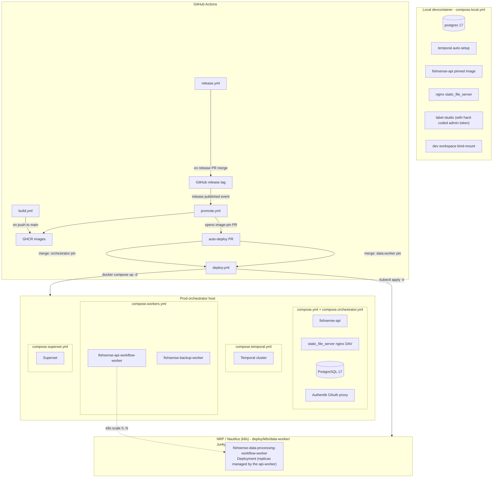
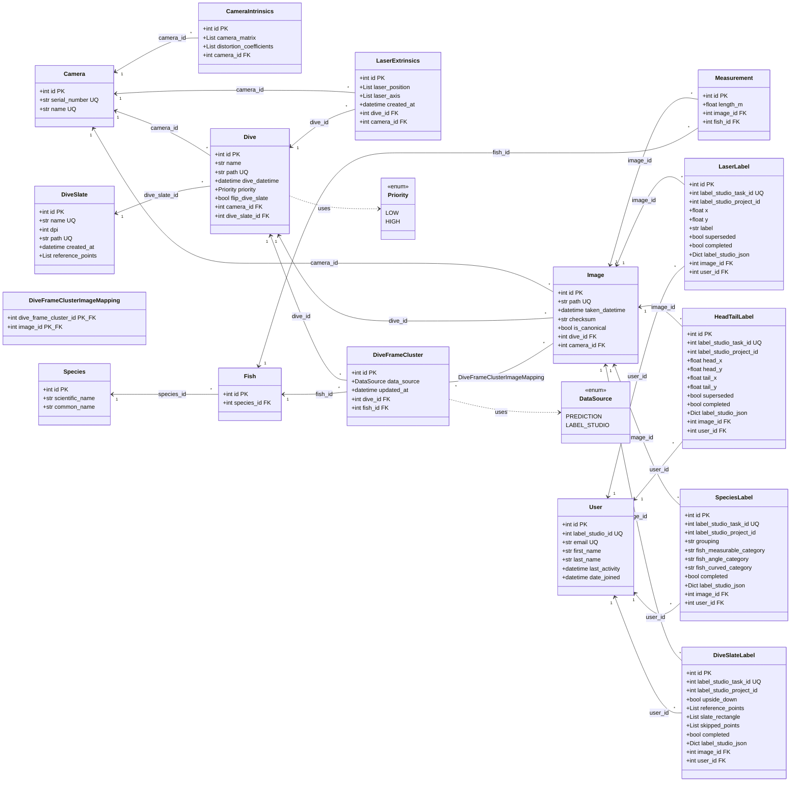
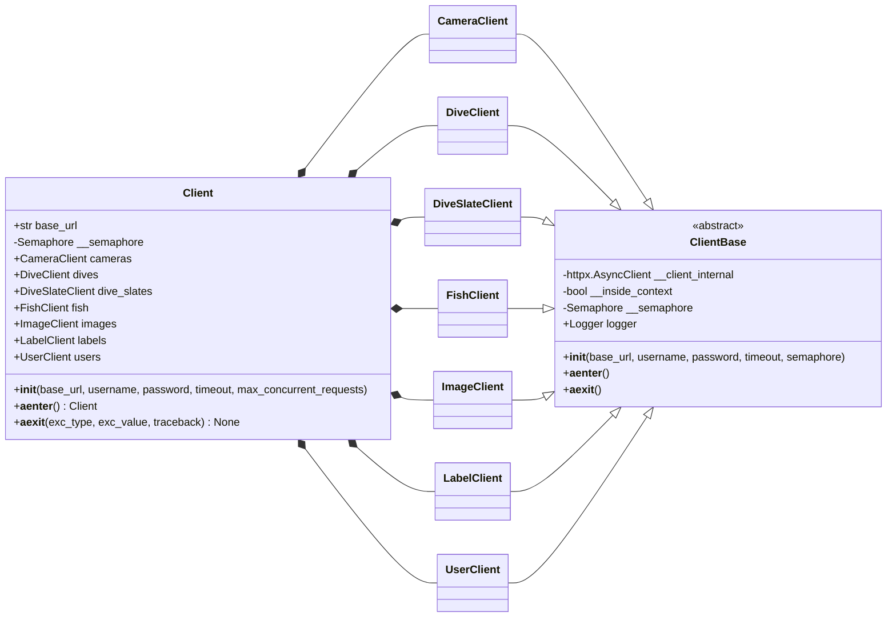
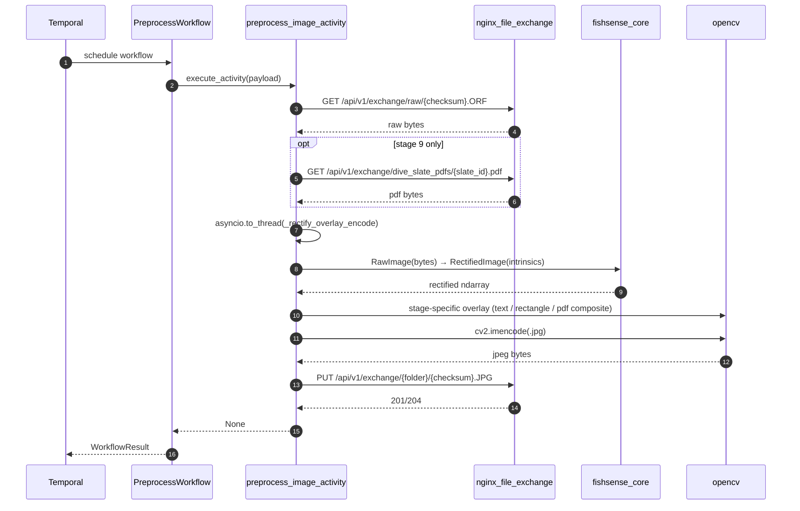
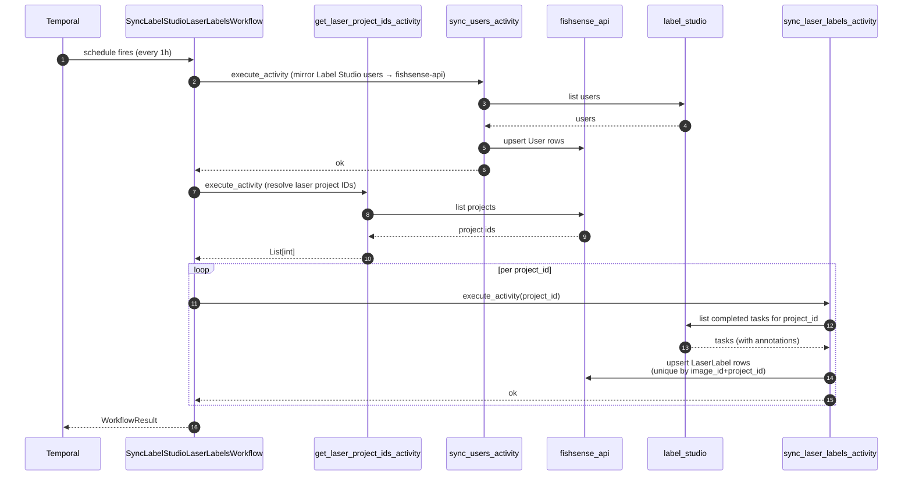
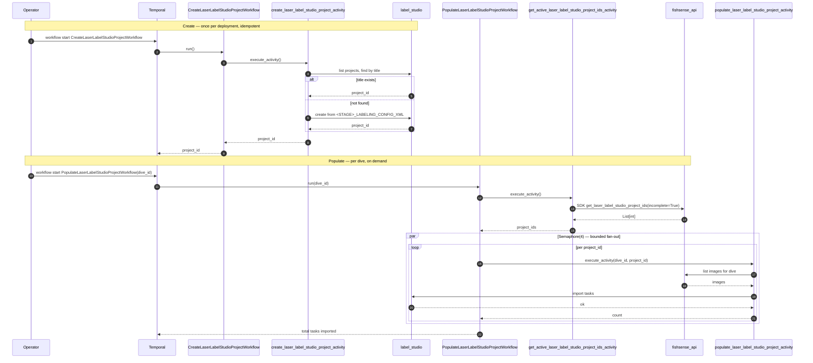
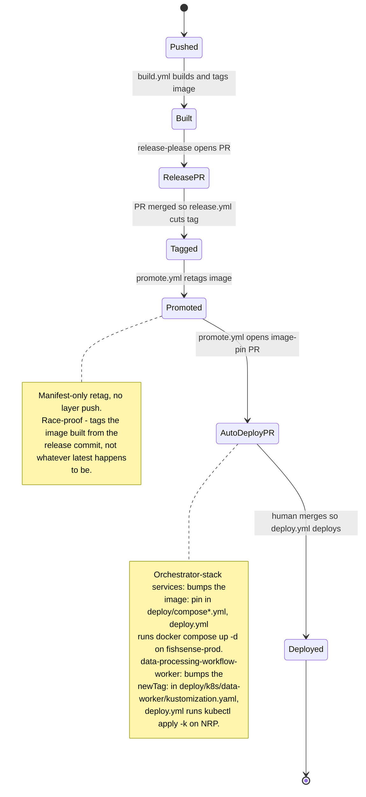

# fishsense-lite-mono — architecture diagrams

UML-flavored Mermaid diagrams. GitHub renders Mermaid natively in
markdown — open this file on GitHub or in any Mermaid-aware editor.

These diagrams are derived from current code; if a diagram and the
code disagree, the code is right and the diagram is stale. Treat them
as a starting orientation, not a contract.

## 1. System context (component diagram)

How the four services, two libs, and external systems wire together.

```mermaid
flowchart LR
    subgraph EXT[External systems]
        LS[Label Studio]
        NAS["E4E NAS<br/>(Synology, FileStation HTTPS)"]
        TC["Temporal cluster"]
    end

    subgraph ORCH["Orchestrator host"]
        API["fishsense-api<br/>(FastAPI)"]
        APIWW["fishsense-api-workflow-worker<br/>queue: fishsense_api_queue"]
        BUW["fishsense-backup-worker<br/>queue: fishsense_backup_queue"]
        PG[("PostgreSQL<br/>fishsense, superset, temporal_db")]
        FX["nginx static_file_server<br/>file-exchange (DAV)"]
        SUP["Superset"]
    end

    subgraph NRP["Kubernetes — NRP/Nautilus now<br/>(Junkyard / Qualcomm: future targets)"]
        DPW["fishsense-data-processing-workflow-worker<br/>queue: fishsense_data_processing_queue<br/>(Deployment, scale-to-zero)"]
    end

    subgraph LIBS["Workspace libraries"]
        SHARED["fishsense-shared<br/>(config, logging, mTLS, exception_group)"]
        SDK["fishsense-api-sdk<br/>(async HTTP client)"]
    end

    API   --->|asyncpg| PG
    APIWW --->|sdk| API
    APIWW --->|label-studio-sdk| LS
    APIWW --->|gRPC mTLS| TC
    APIWW -.->|k8s scale 0..N| DPW
    DPW   --->|sdk| API
    DPW   --->|gRPC mTLS| TC
    DPW   --->|GET raw / PUT jpeg<br/>(authentik basic-auth)| FX
    BUW   --->|pg_dump -Fc| PG
    BUW   --->|FileStation HTTPS| NAS
    BUW   --->|gRPC mTLS| TC
    SUP   --->|read-only| PG

    %% Library deps (workspace)
    API   -.->|imports| SHARED
    APIWW -.->|imports| SHARED
    APIWW -.->|imports| SDK
    DPW   -.->|imports| SHARED
    DPW   -.->|imports| SDK
    BUW   -.->|imports| SHARED
    SDK   -.->|HTTP| API
```

**Why backup-worker is its own service.** Narrower blast radius —
only `pg_dump`-equivalent DB credentials, only NAS write access,
separate task queue, separate image. Mixing it into the
data-processing worker would broaden either side's privileges.

## 2. Deployment topology

What runs where, and which composes file owns what. Maps to the files
in [deploy/](../deploy/).



Notes:

- The deploy PR is intentional — a human reviews the image-pin diff
  (compose `image:` for the orchestrator stack, kustomize `newTag:` for
  the data-worker) before any prod change. See
  [.github/workflows/deploy.yml](../.github/workflows/deploy.yml).
- The orchestrator deploy job uses a persistent ops-managed checkout
  (path passed via repo variable `DEPLOY_DIR`); volumes/secrets sit
  beside the compose files as untracked siblings. The data-worker
  deploy job is a GitHub-hosted `kubectl apply -k` using the
  `NRP_KUBECONFIG` secret — no persistent dir; config/certs live in
  cluster ConfigMaps/Secrets.
- The local stack does **not** layer onto `compose.yml` — Authentik /
  mTLS / letsencrypt aren't bootable on a laptop.

## 3. Domain class diagram (Postgres tables)

Authoritative SQLModel definitions in
[services/fishsense-api/src/fishsense_api/models/](../services/fishsense-api/src/fishsense_api/models/).
The SDK side
([libs/fishsense-api-sdk/src/fishsense_api_sdk/models/](../libs/fishsense-api-sdk/src/fishsense_api_sdk/models/))
hand-mirrors these as Pydantic models; drift is policed by
`tests/test_sdk_drift.py`.



Unique-image-per-Label-Studio-project is enforced via composite
`UniqueConstraint(image_id, label_studio_project_id)` on each of the
four label tables.

## 4. SDK class diagram

Façade in [libs/fishsense-api-sdk/src/fishsense_api_sdk/client.py](../libs/fishsense-api-sdk/src/fishsense_api_sdk/client.py).
Each sub-client owns its own `httpx.AsyncClient` (opened in
`__aenter__`, closed in `__aexit__`). All sub-clients share a single
`asyncio.Semaphore` so `max_concurrent_requests` caps concurrency
across resources, not per-resource.



## 5. Sequence — data-worker per-image preprocess

The shape every stage in the data-worker shares (stages 0.1, 2, 5.1,
9). Stage 9 also fetches a slate PDF; otherwise identical.



The `_rectify_overlay_encode` step is sync CPU work, kept out of the
event loop via `asyncio.to_thread`. Pure-logic
`overlay_and_encode_jpeg` is broken out so unit tests don't need
Temporal, httpx, or fishsense-core decode.

## 6. Sequence — api-worker label sync

Hourly `SyncLabelStudioLaserLabelsWorkflow` (the head/tail variant is
isomorphic). Runs entirely on the orchestrator host.



## 7. Sequence — Label Studio project create + populate

The eight on-demand workflows in the api-worker — Create + Populate
× {Laser, Species, HeadTail, DiveSlate}. Same shape per stage; laser
shown.



Bootstrap caveat: `incomplete=True` returns nothing for a brand-new
project (zero labels), so Populate is a no-op until something seeds
at least one label. Existing prod projects already have labels;
fresh deployments need a seed step that doesn't exist yet.

## 8. CI/CD pipeline (build → release → promote → deploy)

State of an image as it moves from a commit to prod.



## Editing & rendering

- These are Mermaid fences, rendered by GitHub on `*.md` files. Local
  preview: VS Code's *Markdown Preview Mermaid Support* extension or
  the Mermaid Live Editor (https://mermaid.live).
- Keep diagrams aligned with code on the same PR that changes the
  shape. A diagram that drifts is worse than no diagram — readers will
  trust it.
- New service or table: add a node here in the same PR that adds the
  Dockerfile or the SQLModel.
